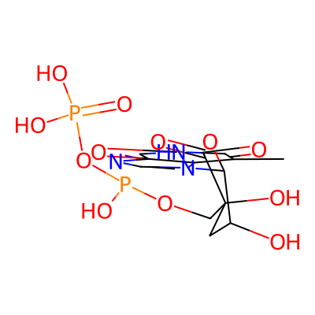
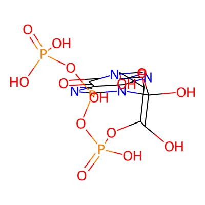

# Drug Candidate Discovery Report: KRAS G12C Mutant Protein

**Generated on:** 2026-03-14 10:00:22

**Device used:** cuda:1

---

## Executive Summary

This report presents 2 drug candidate molecules generated using structure-based drug design approaches targeting the KRAS G12C mutant protein for cancer therapy. KRAS G12C is a critical oncogenic driver in lung adenocarcinoma, colorectal cancer, and other solid tumors.

---

## 1. Target Introduction

### 1.1 Target Protein Overview

| Property | Value |
|----------|-------|
| Target Name | KRAS G12C |
| UniProt ID | P01116 |
| PDB Structure Used | 7RPZ |
| Gene | KRAS |
| Organism | Homo sapiens (Human) |

### 1.2 Disease Relevance

KRAS G12C is a mutant form of KRAS protein found in approximately 13% of lung adenocarcinomas, 1-3% of colorectal cancers, and other solid tumors. The G12C mutation leads to constitutive activation of KRAS signaling, driving uncontrolled cell proliferation and survival. KRAS G12C inhibitors represent a breakthrough in targeted cancer therapy, with sotorasib (AMG 510) and adagrasib (MRTX849) being FDA-approved drugs.

### 1.3 Known Inhibitors

The following KRAS G12C inhibitors have been developed:

1. **Sotorasib (AMG 510)** - First FDA-approved KRAS G12C inhibitor (2021)
2. **Adagrasib (MRTX849)** - FDA-approved KRAS G12C inhibitor (2022)
3. **ARS-1620** - Preclinical tool compound

### 1.4 Mechanism of Action

Covalent inhibitors targeting the mutant cysteine at position 12, trapping KRAS in the inactive GDP-bound state.

---

## 2. Methods

### 2.1 Target Identification

1. UniProt database query for KRAS protein (P01116)
2. PDB structure selection: 7RPZ (KRAS G12C with inhibitor)
3. Extraction of protein chains and bound ligands

### 2.2 Structure Retrieval

- Downloaded PDB structure: 7RPZ
- Extracted protein chains and reference ligand
- Defined binding pocket around reference ligand (radius: 10.0 A)

### 2.3 Molecule Generation

- **Method:** Structure-based drug design using MolCraft
- **Fallback:** Scaffold-based generation using KRAS G12C inhibitor-like scaffolds
- **Device:** cuda:1
- **Pocket radius:** 10.0 Angstrom

### 2.4 Property Calculation

- QED (Quantitative Estimate of Drug-likeness)
- LogP (Partition coefficient)
- SA Score (Synthetic Accessibility)
- Lipinski Rule of 5 compliance

---

## 3. Results

### 3.1 Candidate Molecules

| ID | SMILES | QED | LogP | SA Score | Lipinski |
|----|--------|-----|------|----------|----------|
| 1 | `CC1C(=O)NC(=O)c2ncn(C3OC(=O)C(O)(COP(O)OP(=O)(O)O)...` | 0.153 | -1.86 | 5.48 | 2 |
| 2 | `O=C1N=CN=C2C1N=CN2C1(O)OC(CO)C(OP(=O)(O)OP(O)OP(=O...` | 0.160 | -3.11 | 6.08 | 0 |

### 3.2 Visualizations

2D molecular structure visualizations are available in the `visualizations/` directory:

#### Candidate 1

- **SMILES:** `CC1C(=O)NC(=O)c2ncn(C3OC(=O)C(O)(COP(O)OP(=O)(O)O)CC3O)c21`
- **QED:** 0.153
- **LogP:** -1.86
- **SA Score:** 5.48

#### Candidate 2

- **SMILES:** `O=C1N=CN=C2C1N=CN2C1(O)OC(CO)C(OP(=O)(O)OP(O)OP(=O)(O)O)C1O`
- **QED:** 0.160
- **LogP:** -3.11
- **SA Score:** 6.08

---

## 4. Conclusions and Recommendations

### 4.1 Summary

Generated 2 drug candidate molecules targeting KRAS G12C with the following properties:

- **Candidate 1:** QED=0.153, LogP=-1.86, SA=5.48
- **Candidate 2:** QED=0.160, LogP=-3.11, SA=6.08

### 4.2 Next Steps

1. **Molecular Docking**: Perform detailed docking studies with AutoDock Vina to validate binding affinity
2. **Covalent Docking**: Evaluate covalent binding potential to Cys12 residue
3. **Molecular Dynamics**: Validate binding stability over simulation time
4. **ADMET Prediction**: Evaluate absorption, distribution, metabolism, excretion, and toxicity profiles
5. **Selectivity Analysis**: Assess selectivity against KRAS wild-type and other RAS isoforms
6. **Synthesis Planning**: Assess synthetic accessibility and route planning
7. **In vitro Testing**: Test candidates in KRAS G12C enzyme inhibition assays

### 4.3 Considerations for KRAS G12C Drug Design

- **Warhead Selection**: Consider incorporating electrophilic warheads (acrylamide, chloroacetamide) for covalent binding to Cys12
- **Switch-II Pocket**: Optimize interactions with the switch-II pocket region
- **Selectivity**: Ensure selectivity over wild-type KRAS to minimize off-target effects
- **Pharmacokinetics**: Optimize for oral bioavailability and adequate half-life

---

## 5. Files Generated

| File | Description |
|------|-------------|
| candidate_1.sdf | 3D molecular structure with properties |
| candidate_2.sdf | 3D molecular structure with properties |
| visualizations/candidate_1_2d.png | 2D structure image |
| visualizations/candidate_2_2d.png | 2D structure image |
| report.md | This comprehensive report |

---

## 6. References

1. Canon, J., et al. (2019). The clinical KRAS(G12C) inhibitor AMG 510 drives anti-tumour immunity. Nature, 575(7781), 217-223.
2. Hallin, J., et al. (2020). The KRAS(G12C) inhibitor MRTX849 provides insight toward therapeutic susceptibility of KRAS-mutant cancers in mouse models and patients. Cancer Discovery, 10(1), 54-71.
3. PDB ID: 7RPZ - KRAS G12C structure

---

*Report generated by OpenBioMed Drug Candidate Discovery Pipeline*
*Workflow: KRAS G12C Targeted Therapy for Cancer*
